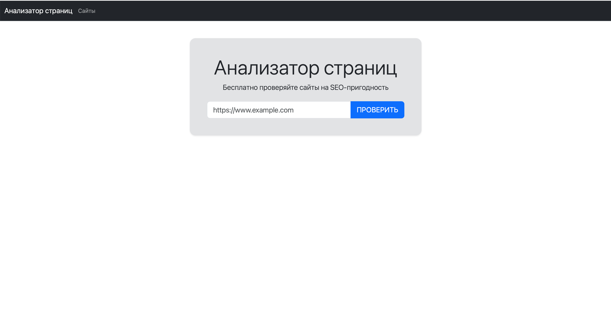
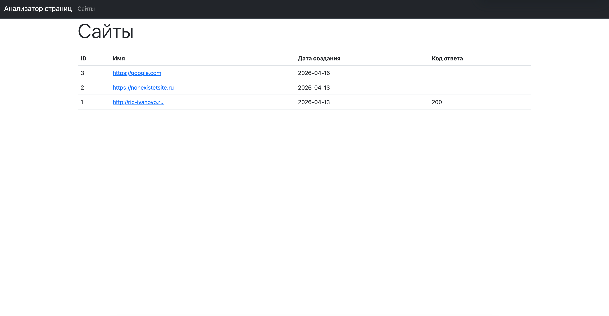
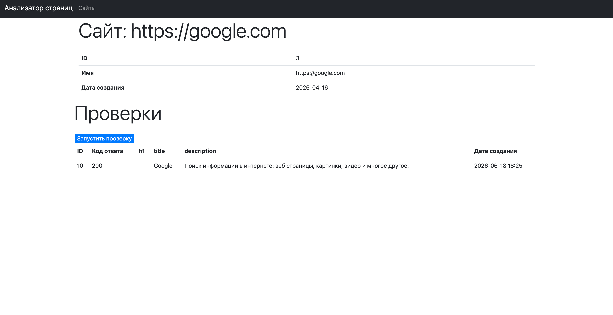

### Статус проекта:

## Page Analyzer:
**Демо:** [Анализатор страниц на Render.com](https://php-project-9-d7cw.onrender.com)

Демо временно частично не функционирует из-за ограничений бесплатного тарифа Render. Проект можно запустить локально по инструкции ниже.

## Описание

**Анализатор страниц** — это веб-приложение для SEO-анализа сайтов. Оно проверяет:

- Статус-код ответа
- Наличие и содержание заголовка `<h1>`
- Наличие и содержание заголовка `<title>`
- Наличие и содержание мета-тега `<meta name="description">`

Приложение сохраняет историю проверок для каждого добавленного сайта и позволяет отслеживать изменения SEO-параметров во времени.

## Функциональность

- ✅ Добавление сайтов по URL
- ✅ Автоматическая нормализация URL (удаление trailing slash, приведение к нижнему регистру)
- ✅ Защита от дубликатов
- ✅ Валидация URL (формат, длина, обязательность)
- ✅ Проверка сайтов с сохранением результатов
- ✅ Парсинг HTML-страниц (h1, title, description)
- ✅ Отображение списка всех добавленных сайтов с последним статусом проверки
- ✅ Детальная страница каждого сайта с историей проверок
- ✅ Flash-сообщения об успехе/ошибках
- ✅ Адаптивный дизайн на Bootstrap

## Скриншоты

### Главная страница

### Список Url

### Страница Url

## Технологии

| Компонент | Технология |
|-----------|------------|
| **Backend** | PHP 8.4 |
| **Фреймворк** | Slim 4 |
| **Шаблонизация** | Slim PHP-View |
| **База данных** | PostgreSQL |
| **ORM** | PDO |
| **HTTP-клиент** | Guzzle |
| **Парсинг HTML** | Symfony DomCrawler |
| **Валидация** | Valitron |
| **Frontend** | Bootstrap 5 |
| **Статический анализ** | PHP_CodeSniffer |
| **CI/CD** | GitHub Actions |

## Структура

| Каталог | Назначение |
|----------|------------|
| `src/Analyzer` | Анализ URL и HTML-страниц |
| `src/Db` | Подключение к PostgreSQL |
| `src/Repositories` | Работа с данными |
| `src/Normalizer` | Подготовка данных для отображения |
| `src/Services` | Бизнес-логика приложения |
| `templates` | Шаблоны страниц |
| `public` | Публичные ресурсы и точка входа |

## Схема базы данных

### urls

| Поле | Тип |
|--------|--------|
| id | bigint |
| name | varchar |
| created_at | timestamp |

### url_checks

| Поле | Тип |
|--------|--------|
| id | bigint |
| url_id | bigint |
| status_code | integer |
| h1 | text |
| title | text |
| description | text |
| created_at | timestamp |

## Требования

- PHP 8.4 или выше
- PostgreSQL 16 или выше
- Composer
- Make

## Установка и запуск

### 1. Клонирование репозитория

`git clone https://github.com/Kromian1/php-project-9.git`

`cd php-project-9`

### 2. Установка зависимостей

`make install`

### 3. Настройка базы данных

Создайте базу данных PostgreSQL:

`createdb page_analyzer_dev`

Экспортируйте переменную окружения:

`export DATABASE_URL=postgresql://localhost:5432/page_analyzer_dev`

Выполните миграцию:

`psql -a -d $DATABASE_URL -f database.sql`

### 4. Запуск приложения

`make start`

Приложение будет доступно по адресу: http://localhost:8000

### 5. Запуск тестов

`make test`

### 6. Линтинг кода

`make lint`

## API Эндпоинты
| Метод | Путь | Описание |
|-------|------|----------|
| GET | `/` | Главная страница с формой добавления URL |
| POST | `/urls` | Добавление нового URL |
| GET | `/urls` | Список всех добавленных URL |
| GET | `/urls/{id}` | Детальная информация о сайте и его проверках |
| POST | `/urls/{id}/checks` | Запуск проверки сайта |

## Примеры запросов

Добавление сайта

`curl -X POST http://localhost:8000/urls \
  -d "url=https://example.com"`
  
Проверка сайта

`curl -X POST http://localhost:8000/urls/1/checks`

## Деплой
Приложение задеплоено на Render.com:

Веб-сервис: https://php-project-9-d7cw.onrender.com

База данных: PostgreSQL (создаётся через Render)

Для собственного деплоя:

Создайте PostgreSQL на Render

Добавьте переменную окружения DATABASE_URL в настройках веб-сервиса

Выполните миграцию: `psql -d $DATABASE_URL -f database.sql`

## Автор

**Михаил Кузнецов**

**GitHub:** https://github.com/Kromian1
